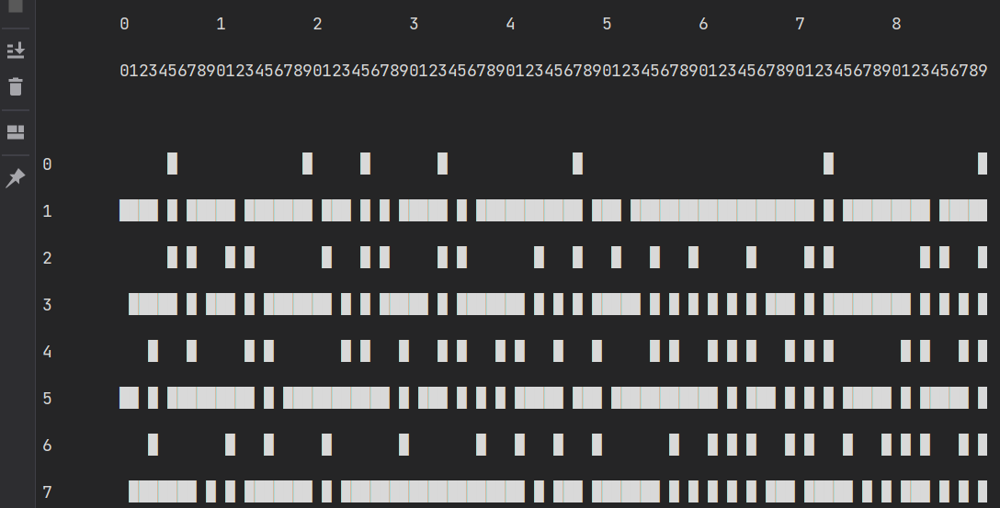
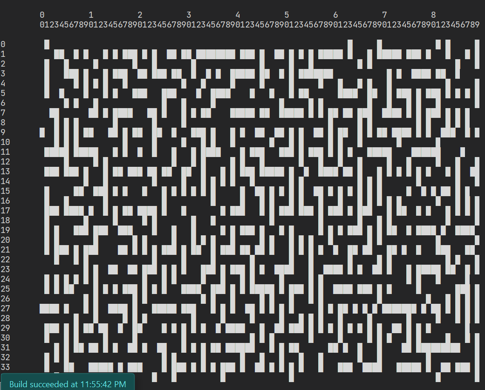

###### Практична робота №2
## Doodle Maps та пошук шляхів

### Мета роботи:
Розібратись з алгоритмами пошуку шляхів A* та Дейкстри, навчитись працювати з графами заданим двомірною сіткою 

## Порядок виконання

### Основне завдання

1. Створіть новий проект та репозиторій. Нагадаємо, що кожна практична має виконуватись в окремому репозиторії, а вклад кожного учасника має бути видимим у коммітах.
2. Скопіюйте в новий проект всі .cs файли з папки [MapGenerator](./../samples/MapGenerator). Ці чотири класи які нам необхідні для генерації карт, по яким ми будемо шукати шляхи.
3. Почніть ваш проект з наступного шаблону коду:
```C#
using Kse.Algorithms.Samples;

var generator = new MapGenerator(new MapGeneratorOptions()
{
    Height = 35,
    Width = 90,
});

string[,] map = generator.Generate();
new MapPrinter().Print(map);
```
В цьому коді спочатку створюється об'єкт типу `MapGenerator`, при чому замість того щоб передавати велику кількість аргументів про те яку саме карту створити, всі ці аргументи загорнуті в окремий об'єкт `MapGeneratorOptions`, по якому зручніше бачити що ми задаємо ширину та довжину карти. Потім ми генеруємо карту, яка є просто двомірним масивом рядків, де стінки позначені символом `█`. В останньому рядку ми створюємо ще один об'єкт - який може виводити карту на екран та викликаємо метод для того щоб її побачити. Якщо ви все зробили правильно та запустите програму зараз, то побачите таке:


Це не дуже схоже на карту, але проблема тільки в тому що Rider за замовчуванням малює завеликі відступи між рядками в консолі. Щоб поправити це, перейдіть у налаштування `File > Editor > Color Scheme > Console Font` а виставіть Line Height у значення 0.8


Якщо перезапустити програму після цього ми побачимо правильний лабіринт:


Тепер розглянемо всі варіанти параметрів, що можна задати у `MapGeneratorOptions`:
- **Width** - ширина карти у символах
- **Height** - висота карти у символах
- **Seed** - значення випадковості, за яким генерується карта. Якщо ви будете ставити його в одне і те саме число, то карта буде генеруватись одна і та ж. Якщо не задавати, то карта буде щоразу різна
- **Noise** - параметр від 0 до 1 який дозволяє прибрати частину стінок. Наприклад, результат при Noise = 0.3:


4. Час виконувати завдання!
Додайте до програми та реалізуйте наступну функцію:

```C#
List<Point> GetShortestPath(string[,] map, Point start, Point goal)
{
    // your code here
}
```
Ця функція має приймати на вхід карту, дві точки (початкову та цільову) та повертати список з точок що складають найкоротший шлях за алгоритмом Дейкстри. Щоб оновити в пам'яті алгоритм, зверніться до:
- [короткої статті](https://www.programiz.com/dsa/dijkstra-algorithm),
- більш розгорнутого, але трохи нудного [опису на вікі](https://en.wikipedia.org/wiki/Dijkstra%27s_algorithm).
- Chapter 7 в Grokking Algorithms (для кращого розуміння потрібно прочитати і 6 главу також)
- дуже детального та [ілюстрованого гайду](https://www.redblobgames.com/pathfinding/a-star/introduction.html)

5. Для того щоб було зручно виконувати попередній пункт, почніть з модифікації методу `Print()` у `MapPrinter.cs`. Розширьте його так, щоб він додатково приймав список точок:

```C#
public void Print(string[,] maze, List<Point> path)
{
 // your code
}
```
При малюванні карти, зробіть так, щоб перша точка відображалась символом `А`, остання - `В`, а всі інші - крапками. Якщо ви почнете з цього, буде значно легше дебажити всю програму, оскільки завжди буде легко виводити шлях на екран

6. Під час виконання завдання, у вас виникне необхідність якось запам'ятовувати поточну мінімальну кількість кроків вд початкової до певної точки, а також вершину, з якої треба прийти, щоб мати цю кількість кроків. У вас є декілька варіантів щоб зробити це:

а) створити два додаткових двомірних масиви для вісдстаней та точок, такої само розмірності, як і масив, який містить граф.

```C#
  int[,] distances = new int[graph.GetLength(0), graph.GetLength(1)];
  Point[,] origins = new Point[graph.GetLength(0), graph.GetLength(1)];
```
І після цього записувати в ці масиви довжину шляху та точки відповідно:
```C#
  distances[point.Row, point.Column] = distance;
  origins[point.Row, point.Column] = origin;
```
Це простий варіант, але не надто ефективний, оскільки він потребує додатково `2n` пам'яті.

б) використати словник. Словник в C# працює так само як і в пайтоні, але потрібно обов'язково вказувати тип ключів та тип значень:
```C#
  // declare
  var distances = new Dictionary<Point, int>();
  var origins = new Dictionary<Point, Point>();
  
  // and use
  distances[point] = distance;
  origins[point] = origin;
```

### Додаткове завдання

## Контрольні питання

## Оцінювання

Максимальний бал - 8:
