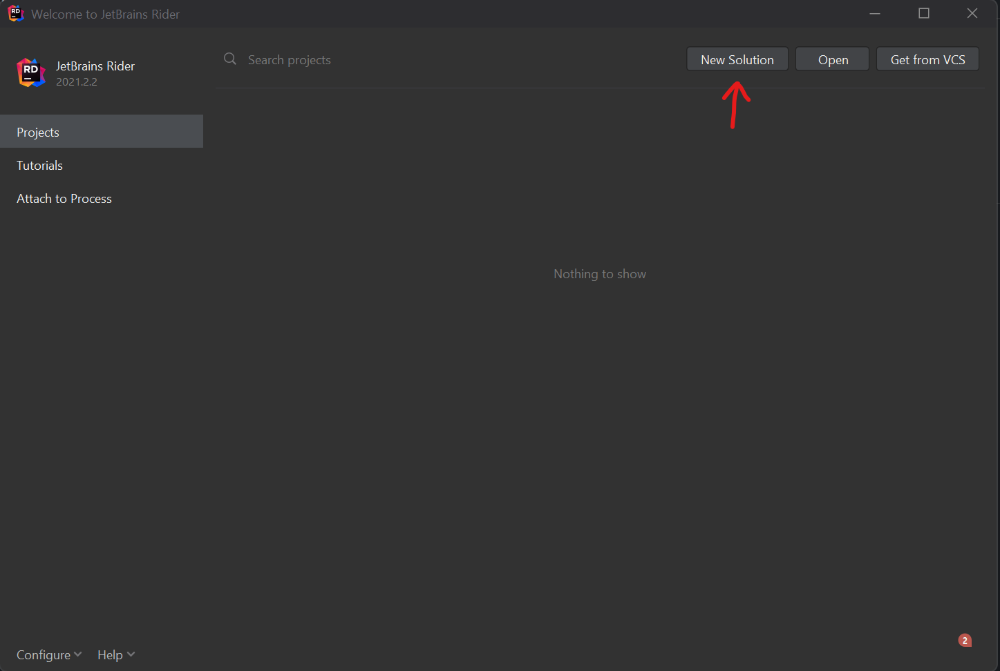
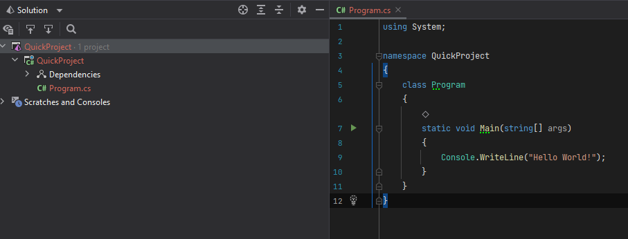

# Перший проект
Загалом, наш курс не обмежує вас в інструментах -  ви можете обрати собі зручну IDE (або писати без неї), гіт-клієнт (або користуватись терміналом) та взагалі компілювати файли самостійно у командному рядку. Але, цей невеличкий гайд дозволить вам налаштувати рекомендоване нами оточення для роботи та швидше перейти до роботи над матеріалом. Отже, що потрібно зробити:

### Початок роботи з C#
1. Завантажте та встановіть [.NET 5 SDK звідси](https://dotnet.microsoft.com/en-us/download/dotnet/5.0), щоб ми працювали на одній платформі та не витрачали час.
2. Завантажте та встановіть [Rider](https://www.jetbrains.com/rider/) - ще одну IDE від JetBrains, схожу на вже знайомий вам PyCharm. Ваша ліцензія за шкільною поштою покриває і цей продукт.
3. Відкрийте IDE та оберіть пункт `New Solution`. У C# код організується у проекти, а проекти - у solutions.

4. Оберіть серед стартових варіантів `.Net Core > Console Application` (це створить проект зі стартовим файлом, який можна запускати). Оберіть нормальне ім'я для проекту
   
5. Rider створить та відкриє вам проект - зліва ви побачите його структуру (файли у C# мають розширення .cs), праворуч - автозгенерований зміст програми, не лякайтеся його :)

6. Зміст файлу корректний, але нам він не потрібен. Можете видалити його та вписати туди два короткі рядки:
```
using System;

Console.WriteLine("Hello, C#!");
```
7. Тепер програму можна запустити

8. Вітаємо, ви створили першу програму на C#!

### Заливання першого проекту на git
